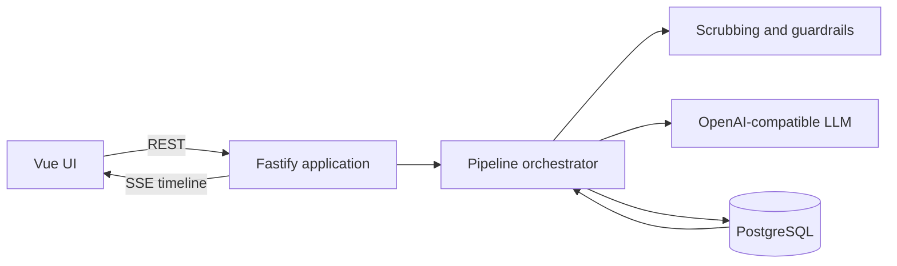

# Medical Case Routing Pipeline

An event-routed workflow for synthetic medical cases. A case moves through an observable pipeline from receipt and sensitive-pattern scrubbing to LLM-assisted classification, deterministic eligibility checks, and specialist assignment. Every transition is persisted and streamed to the Vue UI in real time. Follow-up actions—human review, assignment retry, or a specialist going on PTO—advance the same case history instead of creating a new request.

> **Synthetic demo only.** Do not enter real patient information. This project is not a diagnostic tool, is not intended for patient care, and must not receive real PHI. Its regex-based scrubber reduces accidental exposure of common identifiers but does not provide anonymization or HIPAA compliance.

## Live demo

[Open the deployed application](https://medical-case-routing.onrender.com)

> The Render free tier may take up to a minute to wake after inactivity. Use synthetic data only.

## Features

- Two structured LLM decisions: case classification and eligible-specialist ranking
- Deterministic guardrails around validation, grounding, PTO, expertise, and capacity
- Append-only, ordered case timeline stored in PostgreSQL
- Recoverable real-time updates through Server-Sent Events (SSE)
- Human approval or override for low-confidence classifications
- PTO-triggered reassignment and retry for unassignable cases
- One production service that serves the Vue frontend, REST API, and SSE
- Docker Compose startup with migrations, idempotent seeding, and health checks
- Per-IP quotas and bounded prompt sizes for the shared public demo

## Stack

- **Frontend:** Vue 3, Vite, Tailwind CSS
- **Backend:** Node.js, TypeScript, Fastify
- **Database:** PostgreSQL, Prisma
- **LLM:** OpenAI SDK with a configurable OpenAI-compatible endpoint
- **Real time:** SSE
- **Deployment:** Docker Compose locally; Render blueprint included

## Quick start with Docker

### Prerequisites

- Git
- Docker Desktop, or Docker Engine with Compose
- An API key for the configured LLM provider
- Available local ports `3000` and `5432`

### Run

```bash
git clone https://github.com/amulyakurapati2-sys/medical-case-routing-pipeline.git
cd medical-case-routing-pipeline
cp .env.example .env
```

Set a valid provider key in `.env`:

```env
LLM_API_KEY=your-provider-api-key
```

Then start the complete application:

```bash
docker compose up --build
```

Open [http://localhost:3000](http://localhost:3000).

Docker Compose starts PostgreSQL, waits until it is healthy, applies Prisma migrations, seeds the specialist roster, and starts the application. The initial build may take a few minutes. Later starts can use `docker compose up` unless dependencies or source files changed.

### Verify

```bash
curl http://localhost:3000/health
curl http://localhost:3000/ready
curl http://localhost:3000/api/specialists
```

Expected health responses:

```json
{"status":"ok"}
{"status":"ready"}
```

### Stop or reset

```bash
# Stop containers and preserve database data
docker compose down

# Stop containers and permanently delete the database volume
docker compose down -v
```

PostgreSQL data is stored in the named volume `casepipeline-pgdata`; no host bind mount is used for database data.

## LLM provider configuration

The key, base URL, and model must belong to the same provider. Never commit `.env` or a real API key.

### Groq profile

```env
LLM_API_KEY=your-groq-api-key
LLM_BASE_URL=https://api.groq.com/openai/v1
LLM_MODEL=llama-3.3-70b-versatile
LLM_JSON_MODE=true
```

### OpenAI profile

```env
LLM_API_KEY=your-openai-api-key
LLM_BASE_URL=https://api.openai.com/v1
LLM_MODEL=gpt-4o-mini
LLM_JSON_MODE=true
```

These are the project profiles used during development. Provider model catalogs and availability change over time, so update `LLM_MODEL` to a currently supported model when necessary. Other OpenAI-compatible providers may work by changing these variables, but should be tested before being claimed as supported. Set `LLM_JSON_MODE=false` if a selected provider/model does not support `response_format: { "type": "json_object" }`; application-level JSON extraction and Zod validation still apply.

Additional controls are documented in [.env.example](.env.example), including request timeout, retry count, body limit, and the confidence threshold.

## Architecture



In production, Fastify serves `frontend/dist`, the REST API, and SSE from port `3000`. Docker therefore runs two containers: one combined frontend/backend application container and one PostgreSQL container.

### Case flow

```text
RECEIVED → SCRUBBED → classify
                       ├─ high confidence → CLASSIFIED → ASSIGNED or UNASSIGNABLE
                       └─ low confidence  → NEEDS_REVIEW → CLASSIFIED → assignment
Any processing error → FAILED
PTO follow-up on an assignment → REASSIGNED or UNASSIGNABLE
```

## Design notes

### Ordered state and persistence

`Case` stores the current projection while append-only `CaseEvent` rows form the inspectable history. Events have a per-case sequence number with a database uniqueness constraint. A stage updates the case projection and appends its event transactionally, preventing the timeline and current state from drifting apart.

### LLM boundary

All model calls live under `backend/src/llm`. The model classifies scrubbed text and ranks candidates already approved by deterministic rules. Responses are parsed and validated with Zod; invalid responses are retried within a configured bound and then recorded as `FAILED` rather than disappearing silently. Lightweight metadata records the provider, model, prompt version, latency, and token usage when available.

### Guardrails and final authority

- Raw submission text is held only in memory and is not persisted.
- Common email, phone, DOB, labeled-name, street-address, and long record-number patterns are replaced before an LLM call.
- Classification values must match fixed application enums.
- Low confidence enters `NEEDS_REVIEW` instead of being assigned automatically.
- Candidate filtering enforces department/expertise, PTO, and derived capacity before ranking.
- A model-selected specialist must exist in the supplied candidate list.
- Deterministic rules perform a final veto before assignment. The LLM advises; code decides.

### Idempotency and follow-ups

Human review, PTO, and assignment-retry commands carry a `commandId`. Processed commands are recorded so client retries or double-clicks do not repeat a transition. When an assigned specialist goes on PTO, affected cases are re-evaluated and receive a new event in their existing timelines. Seed upserts create a deterministic roster without duplicating specialists or resetting runtime PTO values on restart.

### SSE recovery

The database is the source of truth. A case stream replays persisted events after `Last-Event-ID`, then subscribes to the in-process event bus for new events. The frontend merges events by ID and refreshes its snapshot after reconnecting, closing the race between case creation and stream connection.

### Production evolution

For this single-instance demonstration, pipeline work runs asynchronously inside the application process. A production-scale version would place stage work on a durable queue and use an outbox or database-backed event transport while retaining the same persisted case/event model.

### Public demo abuse controls

The hosted application is intentionally accessible without user accounts, so all state is shared demo state. To limit anonymous abuse, LLM-backed submissions are capped at five per client IP every ten minutes and case text is limited to 4,000 characters. Review, retry, and PTO commands have separate per-IP quotas, and command IDs must be UUIDs. These in-process limits are appropriate for the single-instance demo; a multi-instance production service should use an authenticated API and a shared limiter such as Redis.

## API summary

| Method | Endpoint | Purpose |
| --- | --- | --- |
| `POST` | `/api/cases` | Submit a synthetic case |
| `GET` | `/api/cases` | List cases and current state |
| `GET` | `/api/cases/:id` | Inspect a case and ordered timeline |
| `POST` | `/api/cases/:id/review` | Approve or override a low-confidence case |
| `POST` | `/api/cases/:id/retry` | Retry an unassignable case |
| `GET` | `/api/cases/:id/stream` | Recoverable per-case SSE stream |
| `GET` | `/api/specialists` | List specialists and derived load |
| `PATCH` | `/api/specialists/:id` | Change PTO state and trigger reassignment |
| `GET` | `/health` | Process liveness |
| `GET` | `/ready` | Database readiness |

## Demo scenarios

Use synthetic descriptions only.

1. **Clean assignment:** Submit a clear cardiology or nephrology case. Observe scrubbing, classification, candidate filtering, model ranking, and assignment.
2. **Human review:** Submit a vague case that receives confidence below `CONFIDENCE_THRESHOLD`. Approve the result or override the department/priority, then watch the same pipeline resume.
3. **Unassignable case:** Submit an orthopedic case while the only eligible orthopedist is on PTO. The deterministic filter records `UNASSIGNABLE` without asking the model to invent an assignee.
4. **PTO follow-up:** Toggle an assigned specialist onto PTO. A reassignment or unassignable event is appended to each affected case timeline.
5. **Retry:** Restore an eligible specialist and retry an unassignable case without resubmitting the original text.

## Deployment

[`render.yaml`](render.yaml) defines one Node web service and one managed PostgreSQL database. The Render build compiles both applications, runs migrations and seeding, and starts the Fastify production server. Configure `LLM_API_KEY` as a secret in Render; the remaining provider and runtime values are declared in the blueprint.

## Project structure

```text
.
├── backend/
│   ├── prisma/             # schema, migrations, and deterministic seed
│   └── src/                # API, pipeline, guardrails, LLM, persistence, SSE
├── frontend/src/           # Vue UI and stream/review composables
├── docker/                 # application image and startup entrypoint
├── docker-compose.yml      # application and PostgreSQL services
├── render.yaml             # Render deployment blueprint
└── .env.example            # safe configuration template
```
